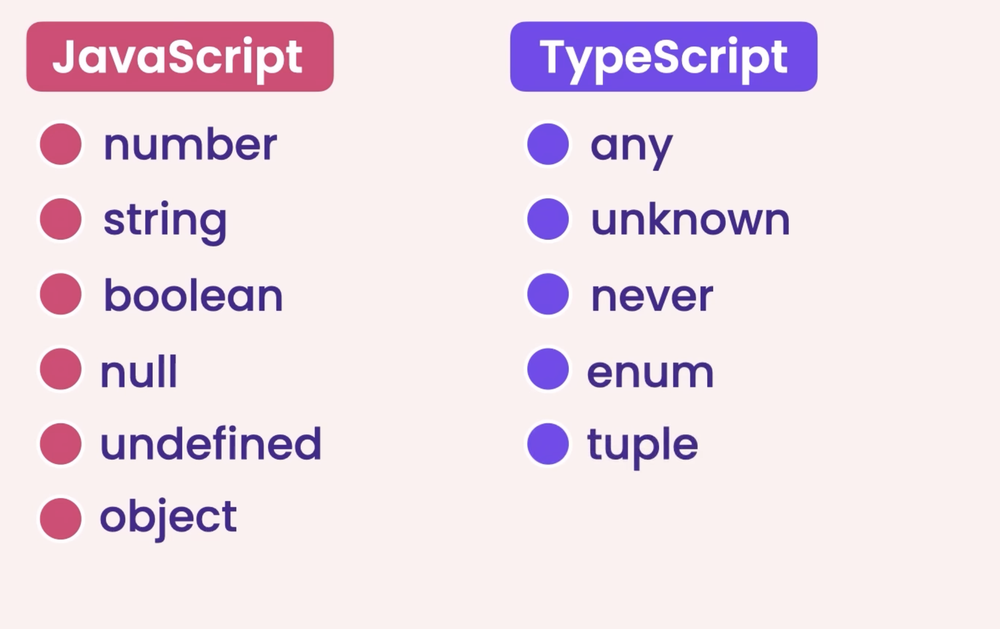
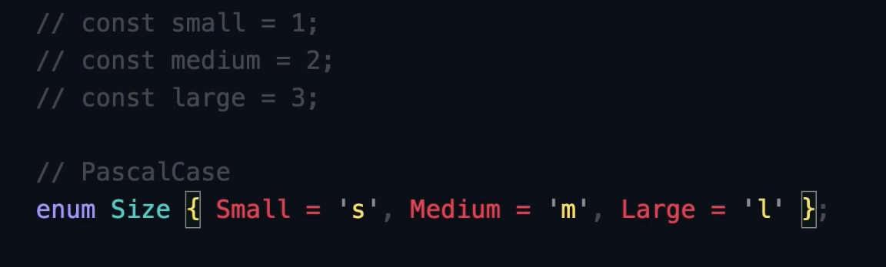
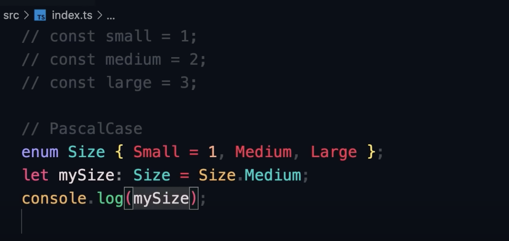
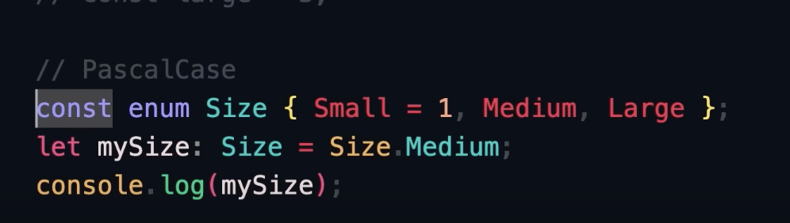
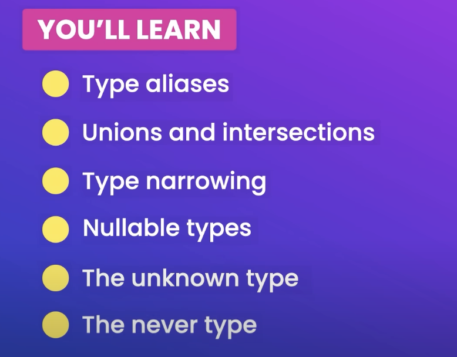
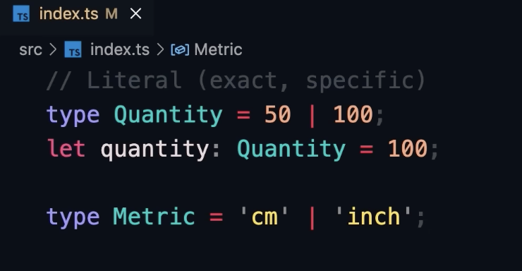
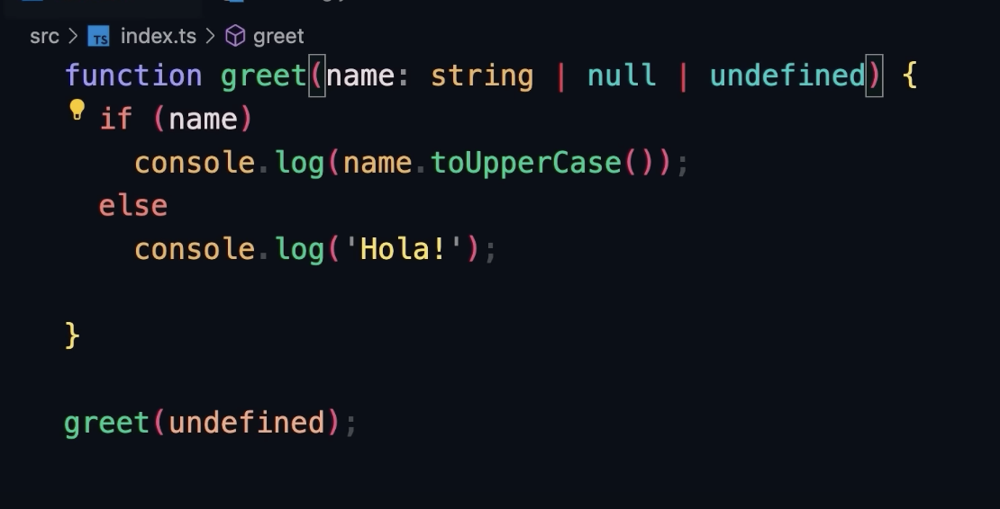
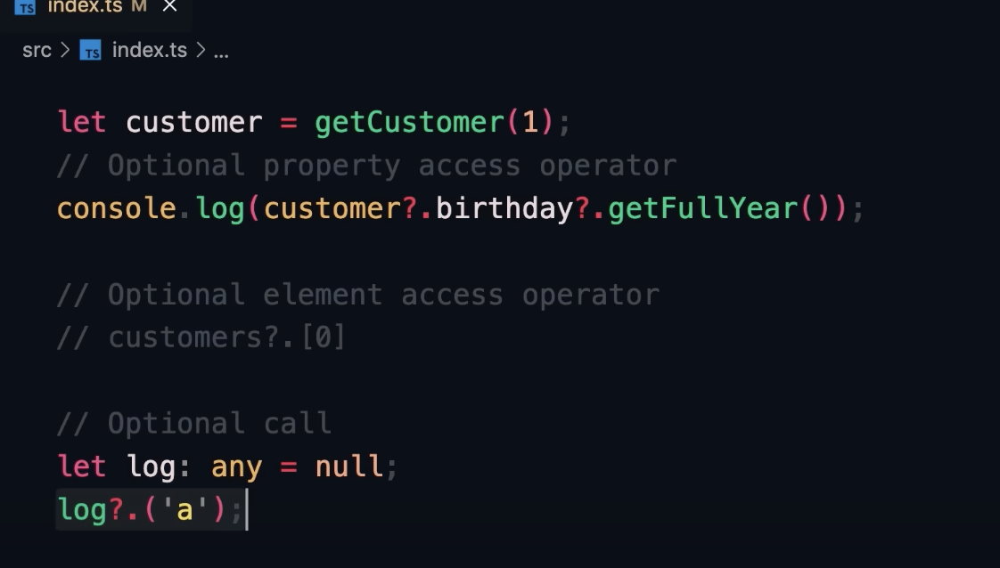

- $ `tsc --init`

- properties of tsconfig.json

  - `target`: specifies the version of js that the ts compiler is going to generate or transpile the ts to. default is es2016 which is a standard implemented in all browsers, a higher target often results in shorter, more concise transpiled code.
  - `rootDir` the directory that contains our source paths, you can change it to the dir of index.ts
  - `outDir:` dir which will contain our js files, uncomment and change it to './dist' or distributable folder
  - `removeComments` set this to true so that the generated js code will be shorter
  - `noEmitOnError`: always good to enable this, it prevents generation of js files when there are ts errors.
  - `module: commonjs`
  - `noUnusedParameters`

- to compile all ts files in the folder: run `tsc`;

- how to debug ts code in vsc:
  - enable `sourceMap` in tsconfig.json, this property generates a sourceMap file which specifies how each line in our ts code maps to a generated line in js code, index.js.map, it is not for us to understand, it is for the debugger to understand.
  - when we add a breakpoint, from this point onwards our code executes line by line
  - go to vsc debugger click on create a launch.json file

# Fundamentals of TS:

TS extends JS's fundamental types like so:


- types can be inferred for primitive initializations such as number, string, boolean, but if you just declare and not initialize a variable it gets type `any`, so the compiler assumes that it can get any type of data, we can set it to a number and later reset it to a string, but this just forgets the mainmotive of using ts.
- avoid using `any` type

## arrays

- in js arrays can contain different types of elements, but in ts we declare the type of elements or set it to any, example of type annotating arrays:
  `let numbers: number[] = [];`

## tuples

- a fixed length array where each element has a particular type, example:
  `let user: [number, string] = [1, 'Yash'];`
- keep tuples limited to 2 values, a good practice
- there is a bug in ts which allows you to do user.push(3) basically append another value to the tuple without breaking

## enums

- a list of related constants
- examples the size of t-shirts as constants
  
- if you dont explicitly assign values then they become 0, 1, 2 and use PascalCase
- example, output is 2:
  
- note that if you declare your enums with a `const` keyword the compiler will generate more optimized js code.
  

## functions

```ts
function validateUser(inp: number): number {
  return NaN;
}
```

- the number of params should be exact, unlike js where we can provide more or less number of parameters
- you can make parameters optional by using `?` and provide default values like so:

```ts
function calc(income: number, taxRate?: number, year = 2022): number {
  return 23;
}
```

- if a value is undefined like in this case:

```ts
function f(x: number): number {
  if (x < 150) {
    return 20;
  }
  return 21;
}
f();
```

then x will be undefined

## objects

if we just declare an object, ts will types of the properties:

```ts
let employee = {
  id: 1,
  name: "abc",
};
```

but if you want to enforce a schema:

```ts
let employee: {
  id: number;
  name?: string;
};
employee = {
  id: 2,
};
console.log(employee);
```

but doing it like this is not reusable so do it using advance types(next section).

- `readonly`:

```ts
let employee: {
  readonly id: number;
  name?: string;
};
employee = {
  id: 2,
};
employee.id = 39; // ! Cannot assign to 'id' because it is a read-only property.
console.log(employee);
```

how to define object's methods inside the schema:

```ts
let employee: {
  readonly id: number;
  name?: string;
  getSalaryByMonth: (data: Date) => void;
};
employee = {
  id: 2,
  getSalaryByMonth: (date: Date) => {
    console.log(date);
  },
};
console.log(employee);
```

# Advanced Types

## 1. Type aliases, `type` keyword



```ts
type Employee = {
  readonly id: number;
  name?: string;
  getDateOfEmployeement: (data: Date) => void;
};
let employee1: Employee = {
  id: 59,
  getDateOfEmployeement(date: Date) {
    console.log(date);
  },
};
let employee2: Employee = {
  id: 69,
  getDateOfEmployeement(date: Date) {
    console.log(Date.now());
  },
};
```

- observe reusability

## Union Types

- allows us to combine types

```ts
function kgToLbs(weight: number | string): number {
    weight.
    if(typeof weight === 'number') {
        weight.
    } else if(typeof weight === 'string') {
        weight.
    }
}
```

- the compiler and vsc are smart enough to guess the available properties for `weight` variable inside the three context, in the first `weight.` the compiler will suggest the properties which are common to both `number` and `string`, in the first if block, it will suggest only `number`'s properties and in the second one only `string`'s

## Intersection

- representing an object which can be more than one type simultaneously which is impossible with primitive types so think objects and see this example:

```ts
type Draggable = {
  drag: () => void;
};
type Resizable = {
  resize: () => void;
};

let widget: Draggable & Resizable = {
  drag: () => {},
  resize: () => {},
};

// or

type UIWidget = Draggable & Resizable;

let widget2: UIWidget = {
  drag: () => {},
  resize: () => {},
};
```

## Literal Types

- when we want to limit the values something can have
  

## Nullable Types

- ts is very strict with null and undefined as they are often the source of bugs.
  

## Optional Chaining

`?.`: if the object (or property) exists then try to access its property (or sub-property) else return undefined

- we can use this with objects but also with arrays:
  
- `customers?.[0]`

- we can also use this when we are uncertain of wheteher a function exists, we can do a optional call:

```ts
// this is the definition you expect but it can also be null
let log: any = (message: string) => console.log(message);
// or
// let log: (message: string) => void = (message) => console.log(message);

// so you call the function optionally like so, and it will run only when log is referencing an actual function:
log?.("logging message.");
```

# TS crash course
## what is TS
- open src lang
- super set of JS
- offers additonal features to JS, including static types
- using types is optional
- compiles or transpiles to regular JS
- types from 3rd party libraries can be added with type definitions

## Pros and Cons
### Pros
- More robust, many errors caught at compile time instead of run time
- Bugs are easily spotted
- predictable
- readable
- popular with respect to job requirements.
### Cons
- more code
- requires transpilation, because browsers dont understand ts
- not true static typing

## compiling TS
- file extensions are .ts or .tsx
- `tsc` -> TS Compiler, transpiles .ts to .js
- Can watch files and report errors at compile time
- the `tsconfig.json` file is used to configure how TS works.
- use `tsc index.ts` to compile .ts to .js
- also use `tsc --watch index`
- use `tsc --init` to setup a configuration file, tsconfig.json